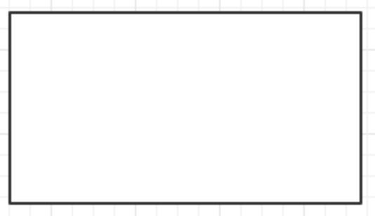
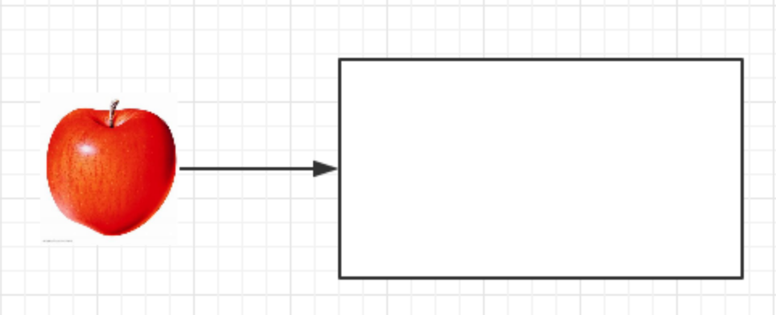

- [x] 第一轮征求意见

- [ ] 第二轮征求意见

- [ ] 第三轮征求意见

- [ ] 推荐提案

## Motivation

Insight 已经迭代很多年, 从最初的大量的覆盖 antd 组件库的样式, 到 2018年 想要成立自己的一套规范, 由于设计师离职, 导致还没有被推动就已经搁浅. 所以现在设计师, 前端开发工程师都有自己的痛点, `比如:`

* 设计师方面, 没有通用组件可以复用, 每一次的设计都需要从头开始

* 前端开发工程师, 无法构建组件库, 无法复用组件, 每一次的设计稿都是从头开始

* 产品方面样式不统一, 交互不统一

成立设计规范和构建组件库是解决以上痛点的重要手段, 但是需要解决以下问题:

* 如何推动一条样式和一个组件

* 如何开发以及文档如何维护

* 如何保证设计师, 前端开发工程师, 产品经理知道某一 组件/样式, 并对其的理解一致

* 如何让某一个人的想法能够让各方充分的理解并决定是否实施

将这些问题拟物化:

1. 我们有一个盒子, 这一个盒子有一个特点, 如果你放进去一个苹果, 这个苹果可以被无限的拿出来, 比如你放进去了一个苹果, 那么你拿出来一个苹果之后里面的这个苹果还是存在的, 你可以无限的拿 

2. 设计师设计了一个苹果, 想要放进去这个盒子, 说我要在 insight 的网站的很多地方都用这个苹果, 设计师该如何推动这个苹果进入这个盒子?  -> 如何推动一条样式和一个组件? 

3. 假设设计师说服各个利益方都觉着这个苹果很棒, 可以加上去, 设计师设计好了, 接下来就是谁和设计师进行进一步的沟通来开发这个苹果?, 这个苹果的细节的文档如何维护, 比如这个苹果的叶子是朝着哪个方向的?, 苹果是什么颜色的? -> 如何开发以及文档如何维护?

4. 如果第3步的问题解决了, 这个苹果的终稿出来了, 进入了这个盒子, 这时候这个苹果的文档, 开发都已经出来的.有可能最后的苹果长这样 

5. 文档, 开发, 设计稿 都已经出来, 然后需要和相关利益方各方推广该苹果, 如何让所有人都知道这个苹果的存在, 让设计在设计的时候使用该苹果, 并在设计稿中指明使用的是这个苹果, 让前端开发知道该苹果, 使用的时候直接调用该苹果 -> 如何保证设计师, 前端开发工程师, 产品经理知道某一 组件/样式, 并对其的理解一致?

6. 每一个人都可以说我想往这个盒子里面放东西, 我想要放置一个梨, 让其他人都可以使用这个梨? 我该如何做? 如何让某一个人的想法能够让各方充分的理解并决定是否实施

> 番外:
> 
> 1. 我在 11.0 改动了 tree 组件的间距和一些样式, 把前端覆盖 antd 的样式去掉了, 我以为产品可以接受, 所以我就偷偷的改掉了. 结果产品还是发现了, 让我把样式还原😅.
> 
> 2. 在做全球新药详情页面的时候和设计讨论了把一个东西抽成组件, 结果我并没有做, 设计也不知道, 我们也没有文档, 而且林潇也不知道我们决定抽出来这个组件. 所以目前也还是没有实现这个组件😅.

目前在运行的实践:

1. Q3 打算改动 Table 组件

2. 设计师提出想要改动 Table 组件的想法, 并给出文档, 和各方进行沟通

3. 设计师和前端持续沟通初期的一些细节

4. 设计师出设计稿

5. 设计稿出来之后, 前端根据文档和设计稿出 demo, 在出 demo 的过程中有可能需要持续性的沟通和修改

6. 前端将 demo 交付给 设计, 由设计师走查, 中间有可能需要持续的沟通和修改

7. 最终交付的东西有: 前端组件代码, 文档, 设计师设计稿, 这项东西将一并被存档至组件库中

8. 将该组件推至 Insight 站点, 来实践该组件, 考验其在生产环境中真正的用处

鉴于以上问题, 提出该提案, 帮助我们流程化我们的工作流程.

## 利益方

* 设计师

* 交互师

* 前端开发工程师

* 产品经理

## 分类

我们要实现的主要分为两大类, 样式和组件

### 样式集合

* 字号和其的行高

* 字体的粗细

* 颜色

* 间距

* ...

### 组件

组件大部分复用 [antd]([https://ant.design/index-cn](https://ant.design/index-cn), 进行一部分的样式覆盖. 目前 antd 版本被锁定在 3.5.4 版本

* Modal

* Table

* Button

* Grid

* ...

## 样式/组件 开发流程

1. 拉上利益方通过 企业微信/会议 进行讨论遇到的痛点, 所有人要同意要 实现/修改 这个 样式/组件, 这种通用的组件影响面会比较大一些

2. 交由 设计师/交互师 进行设计稿的设计, 设计稿完成之后和各方(前端/产品)进行沟通可行性, 难度, 对目前的影响. 然后产出文档/或者是修改文档

3. 设计稿确定之后, 前端工程师进行开发组件 & 出 demo, 开发过程之中可能会持续不断的和 设计/交互 沟通, 前端工程师开发完成之后将 demo 交付 设计师/交互师 进行走查

4. 最终交付的东西有: 前端组件代码, 文档, 设计师设计稿, 这项东西将一并被存档至组件库中

5. 实践, 在生产环境来测试该组件的实用性

## Notes

1. 我们只讨论通用的样式, 组件, 何为通用, 也就是这个组件有可能在多个场景下被使用. 如果某一个场景下需要单独的对某一个组件进行做修改, 仅仅是满足当前场景下的需求. 这不是通用

2. 在一个 组件/样式 还没有被实现的时候, 产品经理/设计师 不能使用该 样式/组件, 只有等 设计稿/前端实现demo/文档 全部完成之后才能真正的实施该组件. 在该组件没有被实现的时候的解决方案一般都是临时的, 并不能复用.

3. 还是遵循 谁痛苦, 谁推动 的原则. 但是前端非常乐意帮助设计解决在开发过程之中的痛点👋
