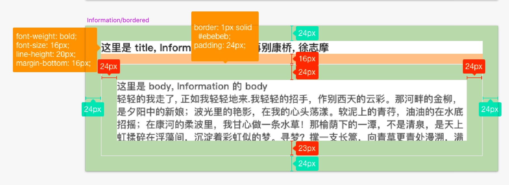

在详情页面经常会用到卡片式的设计, 比如:

* [全球新药详情页](https://db.dxy.net/dev/globalnewdrug/detail?id=45656)  
* [上市产品详情页](https://db.dxy.net/dev/cfda/base?id=181693&dbtype=1) 
* 全球新药适应症详情页(还未上线) 

这些 demo 中都有以下共性:

* 整个块有 24px 的内边距

* 都有一个 title

* 都有内容区域

* 可以有内容区 border, 如果有内容区 border, 那么就会有 24px 的内容内边距, 如果没有 border, 就没有内容内边距 

提案将这些共性抽成一个组件, 需要确定以下事情:

- [x] 组件名
  
  - [x] 中文名 -> 信息
  
  - [x] 英文名 -> information

- [x] 组件的设计细节
  
  - [x] 组件的设计细节图
    
    - [x] default 
    
    - [x] bordered 

- [x] 组件的 props
  
  | name     | type             | required | default |
  | -------- | ---------------- | -------- | ------- |
  | title    | string|ReactNode | false    | -       |
  | bordered | boolean          | false    | false   |

- [ ] demo & 文档

